# APT Casino Monad - Mermaid Architecture Diagrams

## 🏗️ System Architecture Overview

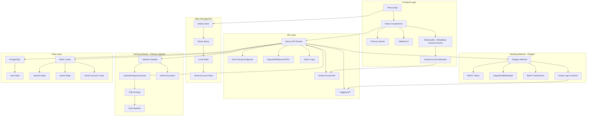

## 🔄 Application Bootstrap Flow

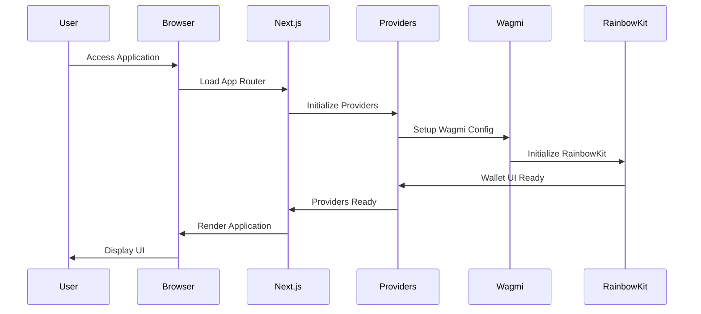

## 🔗 Wallet Connection & Smart Account Flow

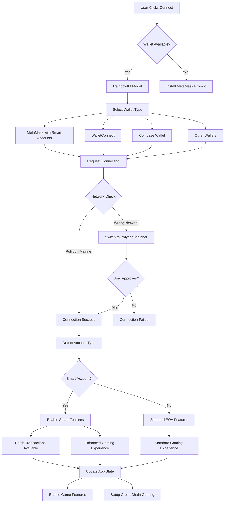

## 🔷 Smart Account Detection & Features

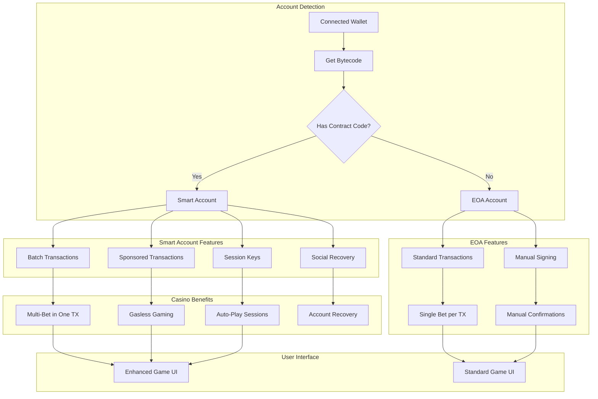

## 🌐 Multi-Network Architecture (Polygon + Arbitrum)

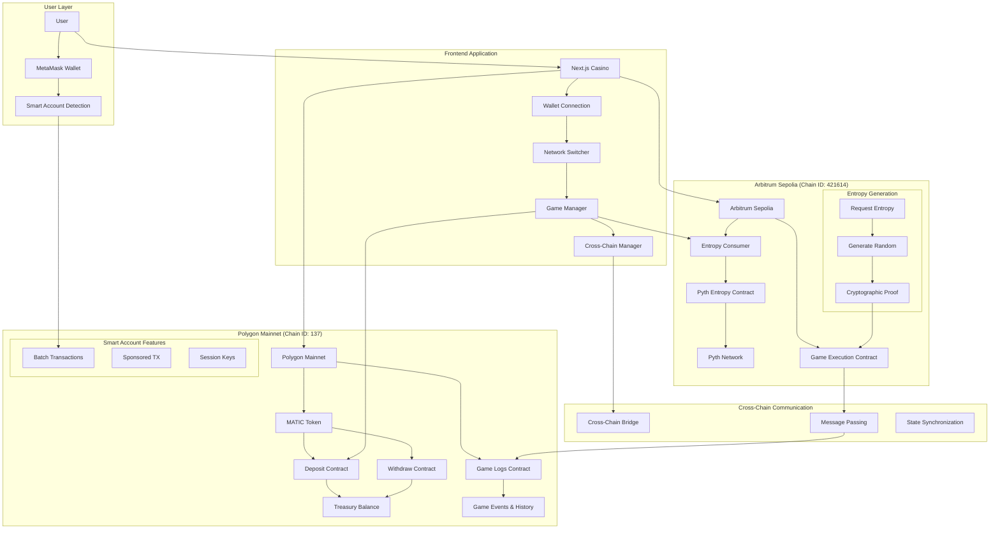

## 🎲 Pyth Entropy Integration Architecture

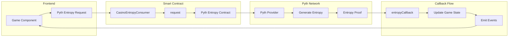

## 🎮 Game Execution Flow (Cross-Chain Enhanced)

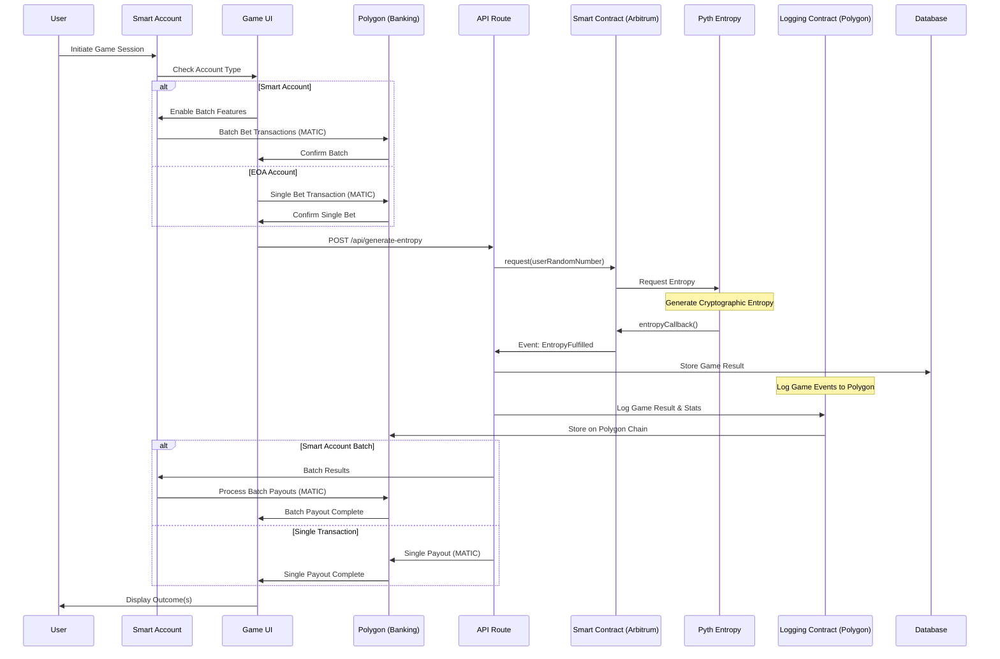

## 🏗️ Smart Contract Deployment Flow

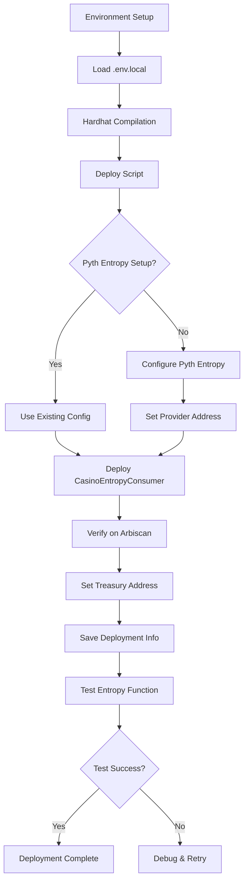

## 🎯 Game-Specific Flows

### Mines Game Flow
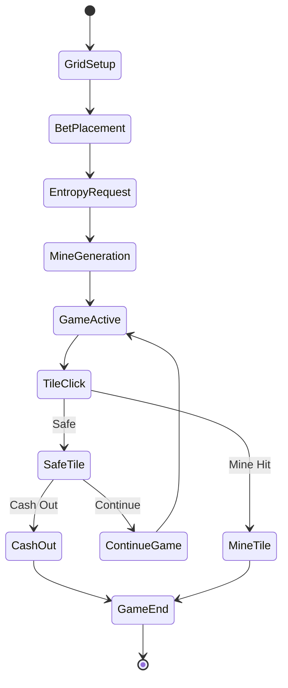

### Plinko Game Flow
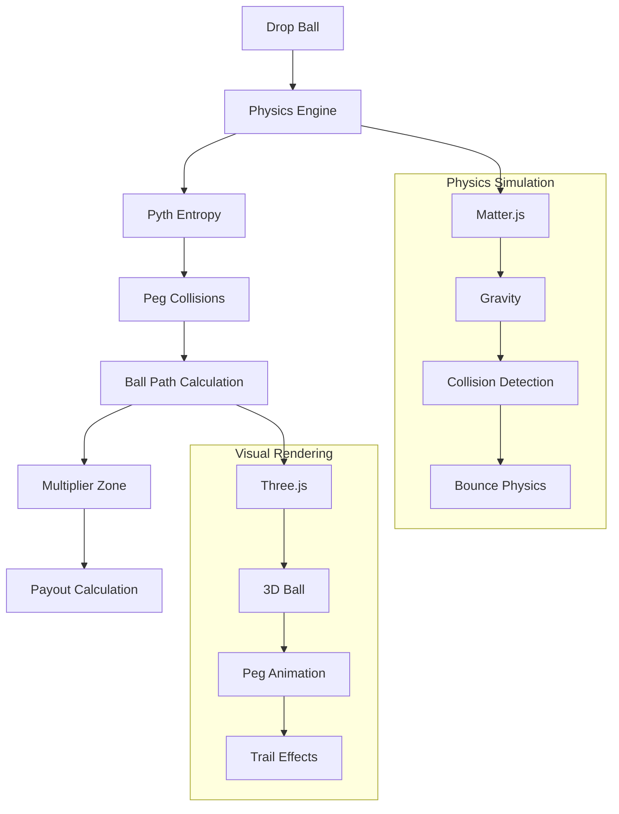

### Roulette Game Flow
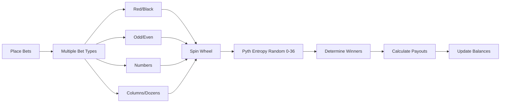

## 🔐 Security & Access Control

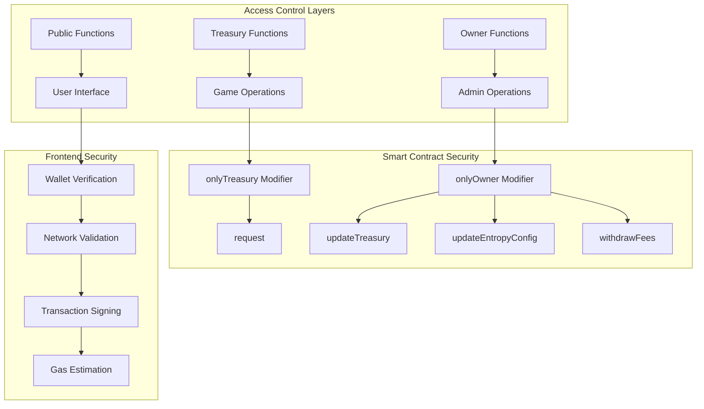

## 📊 Data Flow Architecture

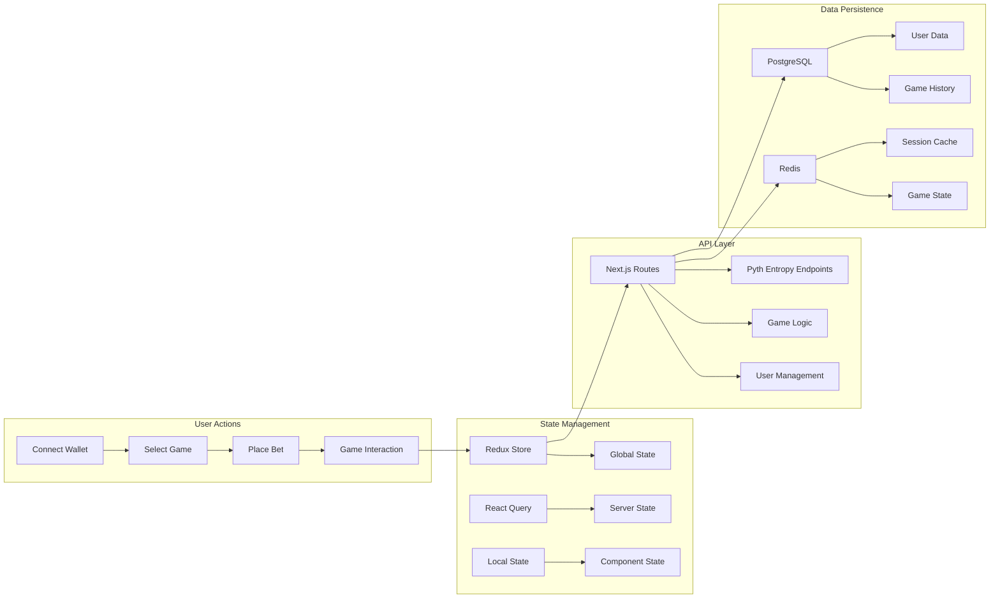

## 🔄 Cross-Chain Request-Response Cycle

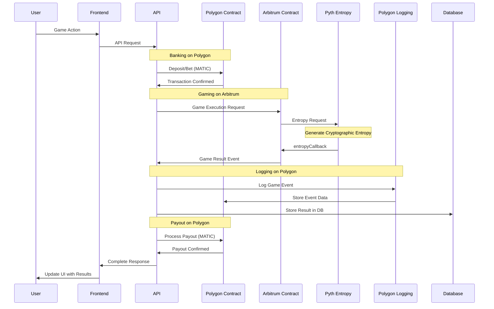

## 🔧 Development Workflow

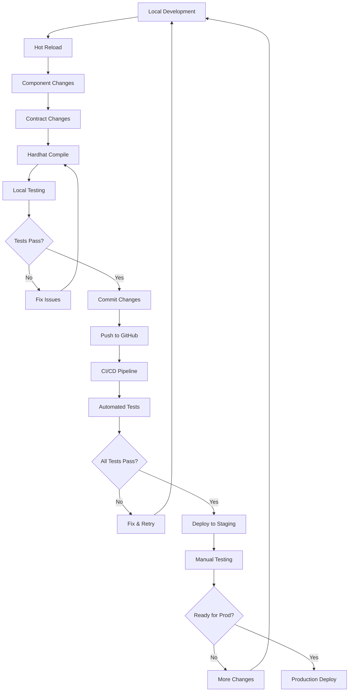

## 📈 Performance Monitoring

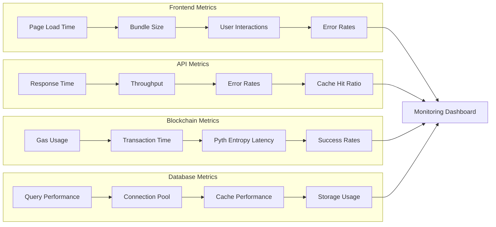

## 🔮 Pyth Entropy Service Integration

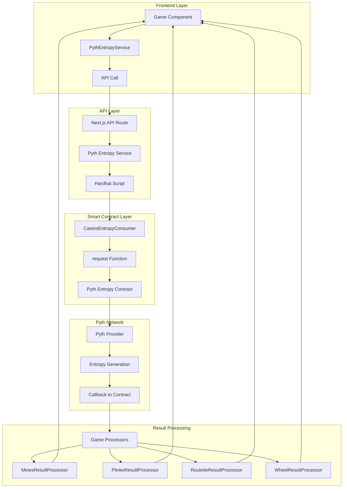

## 🎯 User Journey Flow

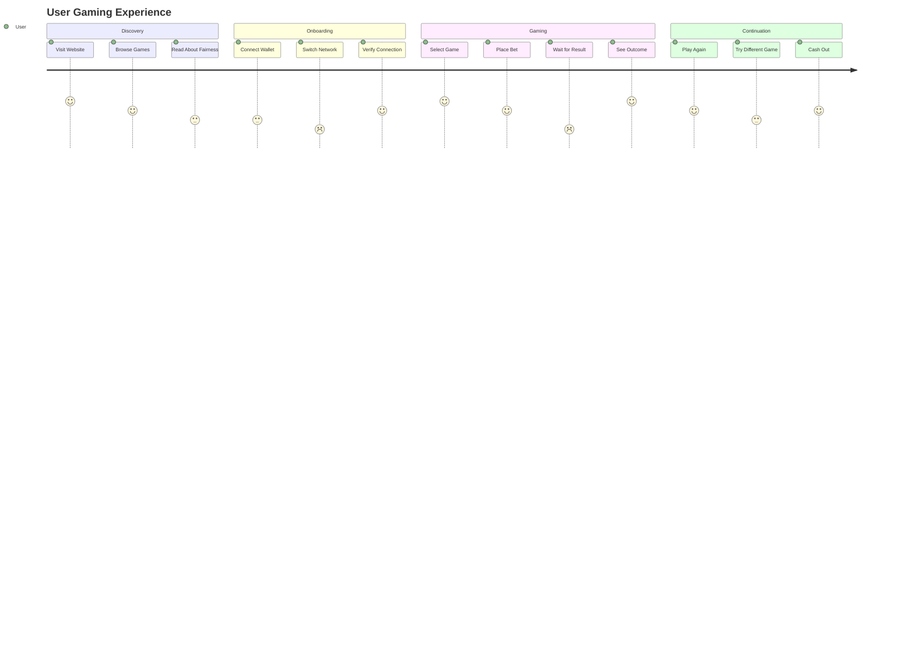

This comprehensive set of Mermaid diagrams provides visual representations of all major architectural components and flows in the APT Casino application, making it easier to understand the complex interactions between different system layers. The diagrams now accurately reflect the current Pyth Entropy integration for random number generation instead of Pyth Entropy.
## 🎯 
Smart Account Gaming Benefits

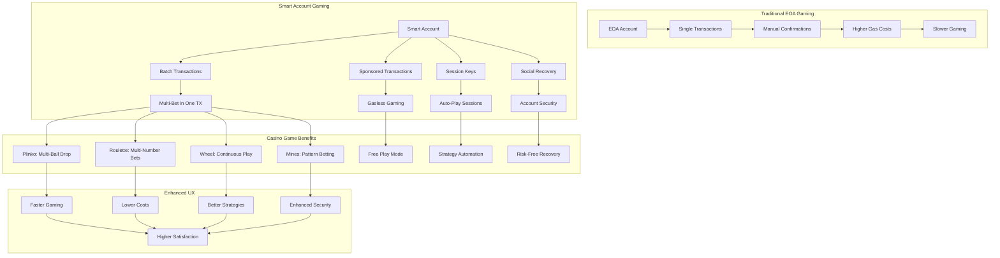

## 🔄 Cross-Chain Smart Account Transaction Flow

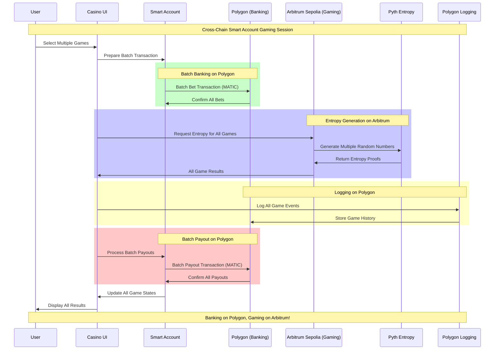

## 🌉 Cross-Chain Gaming Architecture

```mermaid
graph TB
    subgraph UserInterface["User Interface Layer"]
        UI[Casino Frontend] --> WM[Wallet Manager]
        WM --> NM[Network Manager]
        NM --> CM[Chain Manager]
    end
    
    subgraph PolygonChain["Polygon Mainnet - Banking Layer"]
        POL_NET[Polygon Network] --> MATIC_TOKEN[MATIC Token]
        POL_NET --> DEPOSIT_CONTRACT[Deposit Contract]
        POL_NET --> WITHDRAW_CONTRACT[Withdraw Contract]
        POL_NET --> LOGGING_CONTRACT[Game Logging Contract]
        
        MATIC_TOKEN --> TREASURY[Treasury Pool]
        DEPOSIT_CONTRACT --> TREASURY
        WITHDRAW_CONTRACT --> TREASURY
        
        LOGGING_CONTRACT --> GAME_EVENTS[Game Events Storage]
        LOGGING_CONTRACT --> USER_STATS[User Statistics]
        LOGGING_CONTRACT --> AUDIT_TRAIL[Audit Trail]
    end
    
    subgraph ArbitrumChain["Arbitrum Sepolia - Gaming Layer"]
        ARB_NET[Arbitrum Network] --> ENTROPY_CONTRACT[Casino Entropy Consumer]
        ARB_NET --> GAME_CONTRACTS[Game Logic Contracts]
        
        ENTROPY_CONTRACT --> PYTH_ENTROPY[Pyth Entropy Service]
        PYTH_ENTROPY --> RANDOM_GENERATION[Cryptographic Randomness]
        
        GAME_CONTRACTS --> MINES_GAME[Mines Game Logic]
        GAME_CONTRACTS --> PLINKO_GAME[Plinko Game Logic]
        GAME_CONTRACTS --> ROULETTE_GAME[Roulette Game Logic]
        GAME_CONTRACTS --> WHEEL_GAME[Wheel Game Logic]
    end
    
    subgraph CrossChainBridge["Cross-Chain Communication"]
        BRIDGE[Message Bridge] --> STATE_SYNC[State Synchronization]
        BRIDGE --> EVENT_RELAY[Event Relay Service]
        BRIDGE --> BALANCE_SYNC[Balance Synchronization]
    end
    
    UI --> POL_NET
    UI --> ARB_NET
    CM --> BRIDGE
    
    RANDOM_GENERATION --> EVENT_RELAY
    EVENT_RELAY --> LOGGING_CONTRACT
    
    TREASURY --> BALANCE_SYNC
    BALANCE_SYNC --> GAME_CONTRACTS
```

## 💰 MATIC Token Flow Architecture

```mermaid
graph LR
    subgraph UserWallet["User Wallet"]
        USER[User] --> WALLET[MetaMask/Smart Account]
        WALLET --> MATIC_BALANCE[MATIC Balance]
    end
    
    subgraph DepositFlow["Deposit Flow"]
        MATIC_BALANCE --> APPROVE[Approve MATIC]
        APPROVE --> DEPOSIT[Deposit to Casino]
        DEPOSIT --> TREASURY_DEPOSIT[Treasury Pool]
    end
    
    subgraph GamingFlow["Gaming Flow"]
        TREASURY_DEPOSIT --> BET_PLACEMENT[Place Bets]
        BET_PLACEMENT --> GAME_EXECUTION[Execute Games on Arbitrum]
        GAME_EXECUTION --> RESULTS[Game Results]
    end
    
    subgraph PayoutFlow["Payout Flow"]
        RESULTS --> WIN_CHECK{Win/Loss?}
        WIN_CHECK -->|Win| PAYOUT[Calculate Payout]
        WIN_CHECK -->|Loss| HOUSE_EDGE[House Edge]
        
        PAYOUT --> TREASURY_PAYOUT[Treasury Payout]
        TREASURY_PAYOUT --> WITHDRAW_REQUEST[Withdraw Request]
        WITHDRAW_REQUEST --> MATIC_TRANSFER[Transfer MATIC]
        MATIC_TRANSFER --> WALLET
    end
    
    subgraph LoggingFlow["Logging Flow"]
        RESULTS --> LOG_EVENT[Log to Polygon]
        HOUSE_EDGE --> LOG_EVENT
        PAYOUT --> LOG_EVENT
        LOG_EVENT --> POLYGON_LOGS[Polygon Event Logs]
    end
```

## 📊 Performance Comparison: EOA vs Smart Account

```mermaid
graph LR
    subgraph Metrics["Performance Metrics"]
        subgraph EOA_Perf["EOA Performance"]
            E1[1 Game = 1 TX]
            E2[Manual Confirmations]
            E3[Higher Gas per Game]
            E4[Slower UX]
        end
        
        subgraph SA_Perf["Smart Account Performance"]
            S1[5 Games = 1 TX]
            S2[Batch Confirmations]
            S3[Optimized Gas]
            S4[Faster UX]
        end
    end
    
    subgraph Comparison["Direct Comparison"]
        subgraph Time["Time Efficiency"]
            T1[EOA: 5 minutes for 5 games]
            T2[Smart Account: 1 minute for 5 games]
        end
        
        subgraph Cost["Cost Efficiency"]
            C1[EOA: 5x Gas Costs]
            C2[Smart Account: 1.2x Gas Cost]
        end
        
        subgraph UX["User Experience"]
            U1[EOA: 5 Confirmations]
            U2[Smart Account: 1 Confirmation]
        end
    end
    
    E1 --> T1
    S1 --> T2
    E3 --> C1
    S3 --> C2
    E2 --> U1
    S2 --> U2
```